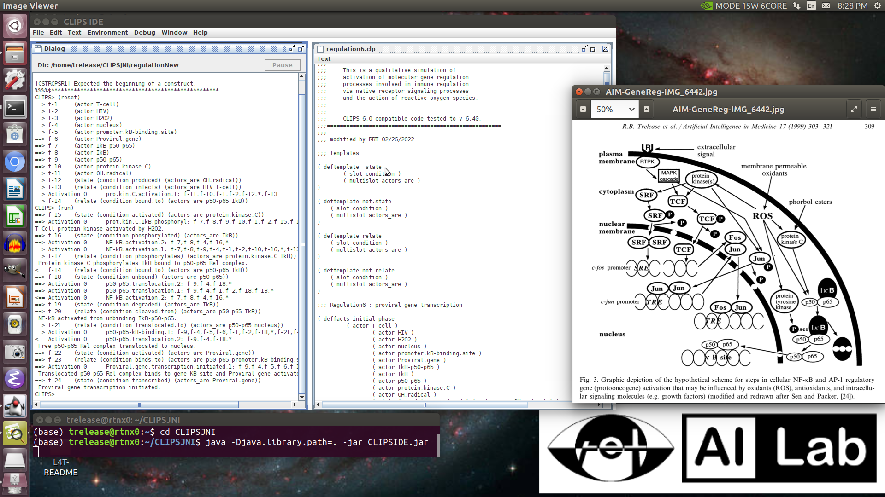

#### <u>AI Lab Notes</u>

##### **1.  Adding symbolic AI programming to Jetson deep neural network development systems**

Several decades after its inception, artificial intelligence (AI) development is now driven by widely useful *connectionist* systems, deep neural network (DNN) simulations that depend on large-scale parallel computing with graphics processing units (GPUs). It is truly the age of high perormance GPU computing, from gaming, 3D simulation, and robotics, through professional design, scientific research, and medicine.

In large part, this AI renaissance has been powered by NVIDIA GPU cards and systems, with their latest Jetson embedded processors providing real-time computer vision, machine learning, natural language, and autonomous machine capabilities in compact low-power systems.

*Given their teraOPs GPU processing speed and a solid base of proven DNN software resources, one could ask why ‘Python friendly’ Jetson developers might want to add ‘old traditional’ symbolic programming tools to their JetPack L4T environments.* 

Simply put, with continually [evolving AI methods](http://aima.cs.berkeley.edu/index.html), newer hybrid [neural-symbolic](https://arxiv.org/abs/1905.06088) (or neurosymbolic) programming is being increasingly adopted for enhancing explainability of DNN-based functions, efficiency of machine learning, and availability of complementary new methods for inference. https://cacm.acm.org/magazines/2022/4/259402-toward-a-broad-ai/fulltext

Over the past two years, the author has worked on assembling a set of compatible open source *symbolic* AI programming tools and utility applications that will integrate well with the Jetsons' Arm64 L4T (Ubuntu) operating system.  These include amd64 Ubuntu 18.04 versions for the EGX-class Xeon 20 + RTX GPU workstation that is the Jetsons’ JetPack SDK host and NGC development archive container manager.

***The images below show first tests of a newly compiled CLIPS 6.40 (2/21) <u> Lisp/Scheme like symbolic programming environment </u> running qualitative  process simulations on a Jetson Xavier NX.***  CLIPS is executing though the OpenJDK Java virtual machine via a .*jar* app launched from a REPL command line. The required CLIPS Java/C .*so* function library was compiled for Jetson's specific arm64 OpenJDK 11 installation.

<u>In the first screen capture image</u>, the upper left *bash* terminal session shows  the end of a successful run of the classic AI 'monkey and bananas' cognitive decision-making simulation https://www.sciencedirect.com/science/article/abs/pii/S0364021377800086  from test code provided with the CLIPS source.

The lower part of the same terminal screen (below the green/blue command lines) shows loading and running an experiment from the author's legacy gene regulation process simulation code.  

Each line represents a molecular process rule firing report, showing one gene activation 'pathway' through the complex interacting 'web' of cellular molecular processes responsible for gene regulation.  This molecular biology process network is graphically depicted in the upper right diagram. 

 A detailed account of this simulation's symbolic knowledge base and related molecular biology qualitative process modeling experiments can be found here:  https://www.sciencedirect.com/science/article/pii/S0933365799000214

<u>The second screen capture image</u> (below) demonstrates the CLIPSJNI IDE running another gene regulation experiment simulation in a multi-concept verbose mode, listing the initial conditions for the experimental system (actors etc.) as well as process rule firings' logic.  

The screen displays CLIPSIDE.jar IDE views of a REPL (command line) window (left) and CLIPS Lisp/Scheme like process rule code text window (right).  The background CLIPSIDE window menu bar supports point-click  files loading, editing, environment functions, execution commands and debug features. 

This experiment uses the same basic CLIPS-format symbolic knowledge base (biological molecules concepts and genetic signalling process rules) as the experiment shown above. This demonstrates that a different set of initial biological conditions results in a different pattern of process activations for a proviral gene.

Robert B. Trelease, Ph.D.  03/31/2022